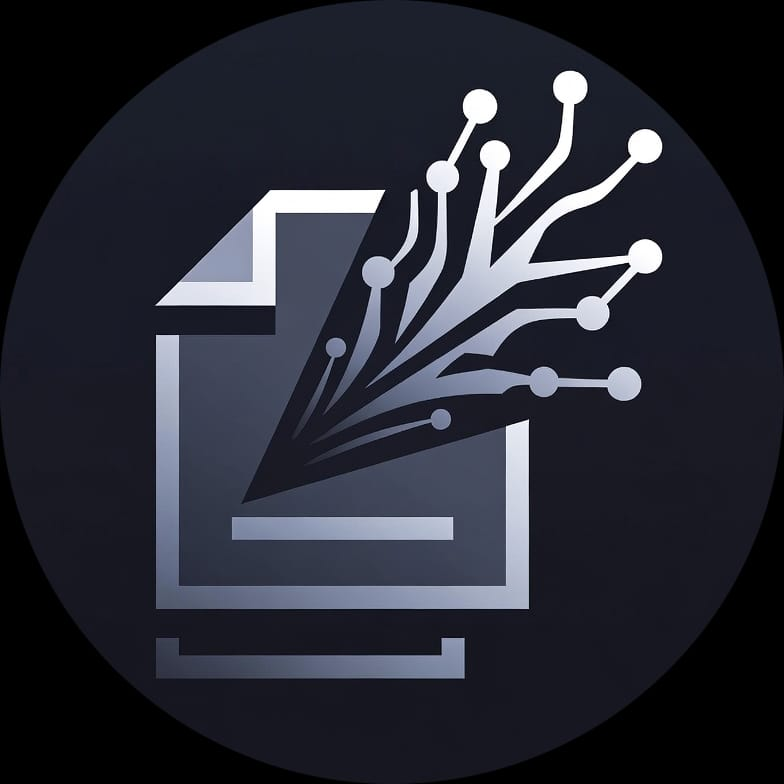

<div align="center">
  
</div>
<p align="center">
 <h1 align="center">ArthPage</h1>
</p>

**ArthPage** is a sophisticated browser extension designed to integrate a contextual AI sidebar heavily optimized for research and reading. It allows users to interact with webpage content using various Large Language Models (LLMs) including OpenAI, Gemini, Claude, DeepSeek, and local Ollama instances.

## 📑 Table of Contents
- [Features](#features)
- [Installation](#installation)
- [Setup Guide](#setup-guide)
  - [Online Models (Cloud)](#online-models-cloud)
  - [Offline Models (Ollama)](#offline-models-ollama)
- [Documentation](#documentation)
- [Tech Stack](#tech-stack)
- [Project Structure](#project-structure)
- [License](#license)

## Features

- **Context-Aware Chat**: Ask questions directly related to the current webpage.
- **Model Flexibility**: Switch between cloud providers (OpenAI, Gemini, Anthropic) and local privacy-focused models (Ollama).
- **Isolated UI**: Built with Shadow DOM to ensure styles do not bleed into or from the host webpage.
- **Persistent Settings**: Syncs preferences and API configurations across browser sessions.
- **Privacy-First**: API keys are stored in local storage and never transmitted to intermediate servers.

## Installation

### For Users

1.  Download the latest release from the **Releases** section.
2.  Extract the archive to a local folder.
3.  Open your browser (Chrome/Brave/Edge) and navigate to `chrome://extensions`.
4.  Enable **Developer Mode** in the top right.
5.  Click **Load unpacked** and select the `dist` folder from the extracted archive.

### For Developers

1.  Clone the repository:
    ```bash
    git clone https://github.com/Start-Up-code/First-Web-Extension.git
    ```
2.  Install dependencies:
    ```bash
    npm install
    ```
3.  Start the development server with Hot Module Replacement (HMR):
    ```bash
    npm run dev
    ```
4.  Load the `dist` folder in `chrome://extensions` as an unpacked extension.

## Setup Guide

### Online Models (Cloud)

To use cloud-based models like **OpenAI, Gemini, Claude, or DeepSeek**:

1.  Open the ArthPage sidebar on any webpage.
2.  Click the **Settings** (gear icon) in the sidebar.
3.  Select your desired provider from the list.
4.  Enter your valid **API Key** in the input field.
5.  The extension is now ready to generate summaries and chat using the cloud provider.

### Offline Models (Ollama)

To use local, privacy-focused models without an internet connection, follow these specific steps to configure **Ollama**:

#### 1. Download & Install
Download and install Ollama from [ollama.com](https://ollama.com).

#### 2. Pull a Model
Open your terminal or command prompt and pull a lightweight model (e.g., DeepSeek or Llama 3) to get started:
```bash
ollama pull deepseek-r1:1.5b
```

#### 3. Configure CORS (Crucial Step)
By default, Ollama blocks requests from browser extensions. You must set the `OLLAMA_ORIGINS` environment variable to allow the extension to communicate with Ollama.

**For Windows (PowerShell):**
1.  Close Ollama from the taskbar (system tray) if it is running.
2.  Open PowerShell and run the following command found in the documentation:
    ```powershell
    [Environment]::SetEnvironmentVariable("OLLAMA_ORIGINS", "*", "User")
    ```
3.  **Restart your computer** or strictly restart the Ollama application.

**For Mac/Linux:**
```bash
OLLAMA_ORIGINS="*" ollama serve
```

#### 4. Start the Server
Once configured, ensure the Ollama server is running:
```bash
ollama serve
```

#### 5. Connect ArthPage
1.  Open the ArthPage sidebar.
2.  Go to **Settings** and select **Ollama** as the provider.
3.  Ensure the URL is set to `http://localhost:11434` (default).
4.  Select your pulled model (e.g., `deepseek-r1:1.5b`) from the dropdown.

## Documentation

Detailed documentation is available in the `docs` directory:

- [**Developer Guide**](docs/developer-guide.md): Advanced setup and build processes.
- [**Architecture**](docs/architecture.md): System design, message passing, and component isolation.
- [**Providers**](docs/providers.md): Supported LLMs and integration details.
- [**Contributing**](docs/contributing.md): Guidelines for code contributions.

## Tech Stack

- **Framework**: React 18
- **Language**: TypeScript
- **Build Tool**: Vite + CRXJS
- **Styling**: Tailwind CSS (Shadow DOM compatible)
- **State Management**: React Hooks + Chrome Storage API

## Project Structure

```text
First-Web-Extension/
├── public/           # Static assets
├── src/
│   ├── background/   # Service workers (API handling)
│   ├── components/   # React UI components
│   ├── content/      # Injected scripts (Shadow DOM host)
│   ├── lib/          # Utilities and LLM clients
│   ├── options/      # Options page
│   ├── popup/        # Extension popup
│   └── manifest.json # Manifest V3 configuration
└── vite.config.ts    # Build configuration
```

## License

MIT
