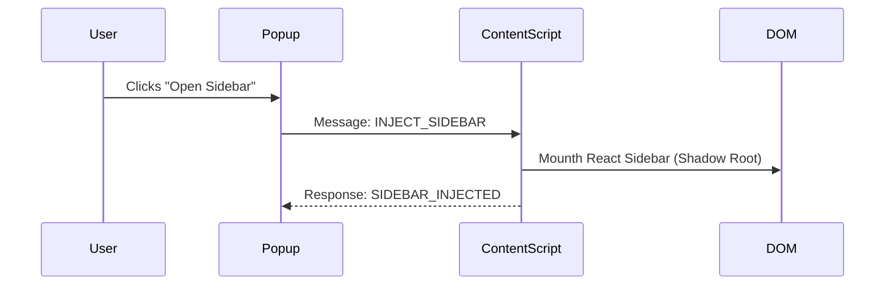
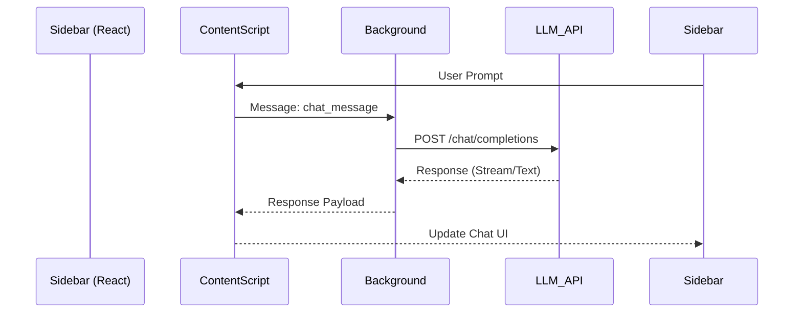

# Architecture Overview

ArthaPage employs a message-passing architecture to coordinate between isolated browser extension contexts.

## Core Components

The architecture consists of three primary isolated environments:

1.  **Popup (User Interface)**
    -   **Context**: Separate browser process.
    -   **Constraint**: Ephemeral; terminated when focus is lost.
    -   **Function**: Manages user preferences and triggers content script injection.

2.  **Content Script (Page Integration)**
    -   **Context**: Runs within the target webpage.
    -   **Constraint**: Access to DOM, but constrained by CSP and CORS policies.
    -   **Function**: Injects the Sidebar UI, scrapes content, and relays messages.
    -   **Isolation**: Encapsulated within a **Shadow DOM** to prevent CSS leakage.

3.  **Background Worker (Service Layer)**
    -   **Context**: Independent background process.
    -   **Constraint**: No access to DOM; purely event-driven.
    -   **Function**: Orchestrates API calls (OpenAI, Ollama), manages persistent storage, and handles cross-origin requests.

## Communication Logic

The extension uses the Chrome Messaging API (`chrome.runtime.sendMessage` and `chrome.tabs.sendMessage`) for asynchronous communication.

### 1. Sidebar Injection Flow

### 2. Chat Request Flow

Content Scripts cannot always make direct API calls due to CORS restrictions. Requests are routed through the background worker.

## Styling & Isolation

To ensure visual consistency across any website:

-   **Shadow DOM**: The entire React application is mounted inside a Shadow Root (`mode: 'open'`).
-   **Tailwind CSS**: Styles are injected directly into the Shadow Root via constructed stylesheets, bypassing the host page's global CSS cascade.
